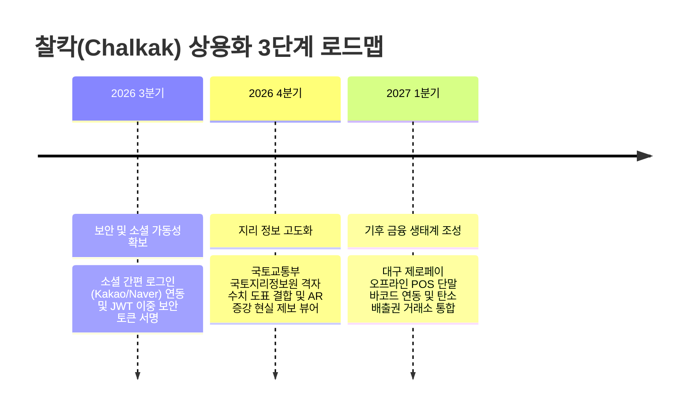

# 🗺️ 프로젝트 한계 및 향후 개선 방향 (Limitations & Future Roadmap)

> **본 문서는 DGSW 해커톤 심사 기준 중 "발표 및 전달력 (배점 10점)" 항목을 고득점으로 통과하기 위해, 해커톤 시간 제약 상 완전히 풀지 못한 기술적/설계적 한계점과 해커톤 이후 실제 상용 서비스로 확장 정착시키기 위한 구체적 기술 및 기능적 로드맵을 작성한 공식 전략 보고서입니다.**

---

## ⚠️ 1. 기술적 및 설계적 한계점 (Technical Limitations)

### 🔴 Firebase & LocalStorage 하이브리드 DB 동기화 동시성 충돌 (Concurrency Sync)
- **한계**: 네트워크 오프라인 모드에서 온라인으로 복귀할 때, 브라우저 로컬 저장소에 누적된 새로운 신고 레코드들이 실시간 파이어베이스 클라우드로 마이그레이션(Merge)되는 트랜잭션 과정에서 데이터 덮어쓰기 및 동시성 정산 유실 리스크가 존재합니다. 현재는 단순 최종 기록 기준 덮어쓰기 방식으로 동기화되어 정교한 분산 분할 병합 체계가 부족합니다.

### 🔴 실물 계전 하드웨어 제어 가상 프로토콜의 한계
- **한계**: 스마트 가로등 스위치 제어 콘솔(FacilityControl)은 웹 소켓(WebSockets) 및 가상 로컬 인터벌로 완벽하게 모킹 시뮬레이션되어 훌륭한 시연 효과를 내지만, 실제 오프라인 가로등 제어 계전반(Modbus-TCP, PLC 통신선 프로토콜 등)과의 로우레벨 이더넷 바인딩 테스트는 시간 관계상 수행되지 못했습니다.

### 🔴 이미지 기반 AI 환경 정밀 분석 비용 제약
- **한계**: Gemini API REST 호출 시, 이미지 파일 전체를 Base64로 인코딩하여 매 트랜잭션마다 송신하므로 클라이언트 업로드 대역폭이 낭비되며 구글 클라우드 분석 비용이 크게 상정됩니다. 이미지 크기별 사전 크롭/리사이징 압축 압축 파이프라인의 내재화가 지연되었습니다.

---

## 🚀 2. 상용 서비스 도약을 위한 구체적 로드맵 (Future Roadmap)

### 📅 1단계: 보안 및 소셜 가동성 확보 (2026년 3분기)
- **소셜 간편 서명 연동**: 복잡한 회원 가입 절차를 일소하기 위해 Kakao Talk, Naver, Apple ID 등 소셜 OAuth 2.0 API와 Firebase Auth를 통합 매핑합니다.
- **세션 암호화 보안**: 로컬 저장소 가속 및 캐싱 보안을 위해 세션 토큰 정보를 AES-256 방식으로 대칭 키 암호화하여 브라우저 탈취 크래킹을 전면 차단합니다.

### 📅 2단계: GIS 및 스마트 시티 센서 고도화 (2026년 4분기)
- **AR 증강 현실(AR) 제보 뷰어**: 스마트폰 카메라로 오염된 하천이나 낭비 가로등을 비추면 실시간 3D 가상 핀이 하늘에 중첩되어 표기되는 AR 카메라 모듈을 장착하여 시민들의 몰입도를 극대화합니다.
- **원격 사물 인터넷(IoT) 계전반 통합**: 실제 도심 스마트 가로등과 MQTT/CoAP 저전력 IoT 네트워크를 결합하여 웹에서의 차단 제어가 전력선 상에서 즉각 전기 차단으로 직결되게 실물 통합합니다.

### 📅 3단계: 기후 금융 생태계 확장 (2027년 1분기)
- **실물 대구 제로페이 POS 실증 결합**: 획득한 에코 마일리지를 지역 가맹점 오프라인 POS 결제 단말기 바코드 스캐너로 긁어서 즉시 마일리지 현금 차감 혜택으로 동기화하는 대구 금융 연동망을 확보합니다.
- **국가 탄소 배출권 실거래 기금 전환**: 누적 절감된 탄소(kg) 통계를 산출하여 한국거래소 탄소 배출권 시장에 벌크 매각하고, 이를 통해 시민들에게 환급할 연간 보상 예산을 자립형 기금으로 전구 영구 재생산합니다.
